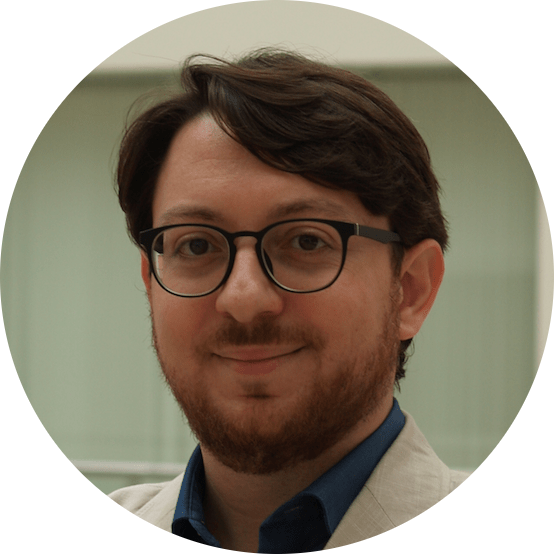

# Speakers

Confirmed speakers are listed below. Additional speakers and organizations will be added once their attendance is confirmed.

## Invited Speakers

|| Name                      | Affiliation                    | Talk Title |
||---------------------------|-------------------------------|------------|
|| Radmila Segol              | Kyiv Aviation Institute (UA)               |TBD |
|| Xuesu Xiao              | George Mason University (USA)               |Learning Extreme Off-Road Mobility  |
| | Zeynep Temel                      | Carnegie Mellon University (USA)      | TBD  |
|| Jee-Hwan Ryu              | KAIST (Korea)           | Soft Growing Robots: From Disaster Response to Colonoscopy |
|| Davide Scaramuzza              | University of Zurich (Switzerland)         | TBD  |
|| Luca Carlone             | Massachusetts Institute of Technology (USA)         | TBD  |
