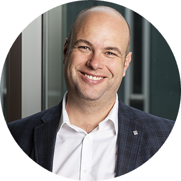

# Speakers

Confirmed speakers are listed below. Additional speakers and organizations will be added once their attendance is confirmed.

## Invited Speakers

|| Name                      | Affiliation                    | Talk Title |
||---------------------------|-------------------------------|------------|
|| Yevhen Artamonov             | Kyiv Aviation Institute (UA)               | A Drone Has No Path; a Drone Has a Target |
|| Xuesu Xiao              | George Mason University (USA)               |Learning Extreme Off-Road Mobility  |
| | Zeynep Temel                      | Carnegie Mellon University (USA)      | Heterogenous Collaboration of Unconventional Robots  |
|| Jee-Hwan Ryu              | KAIST (Korea)           | Soft Growing Robots: From Disaster Response to Colonoscopy |
|| Davide Scaramuzza              | University of Zurich (Switzerland)         | From Drone Racing to Disaster Response: Agile Autonomy in the Real World  |
|| Lukas Rosenberger Schmid | Technische Universität Nürnberg (Germany)    | Dynamic Robot Memory for Humanitarian Assistance |
|| Sebastian Scherer | Carnegie Mellon University    | Team Chiron’s Approach to Save the Maximum Number of Lives with a Team of Autonomous Robots in Mass Casualty Situations |
|| Darwin Mick | Carnegie Mellon University    | Field Deployment of Snake Robots During the Venezuelan Earthquake Response |